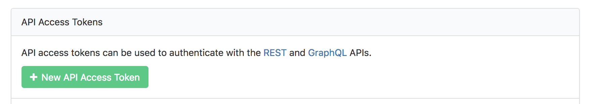

# bkcli

An easy to use buildkite command line tool.

Features:

* Prints logs in `ANSI` color
* `tail -f` style output for build logs
* Trigger builds from the command line
* Uses config ini (`~/.bkcli/config`) to manage different tokens and orgs


## Installing


1. Download the latest [release](https://github.com/stellargraph/bkcli/releases) binary for your platform
2. Make sure it's executable
3. Move the binary to a folder in your `$PATH`

For example, assuming `/usr/local/bin` is in your `$PATH`

### Linux

```bash
wget https://github.com/stellargraph/bkcli/releases/download/v0.0.1/bkcli-linux
chmod +x bkcli-linux
mv bkcli-linux /usr/local/bin/bkcli
```

### MacOS

```bash
wget https://github.com/stellargraph/bkcli/releases/download/v0.0.1/bkcli-macOS
chmod +x bkcli-macOS
mv bkcli-macOS /usr/local/bin/bkcli
```

### Windows

Currently untested


## Building

Install [govendor](https://github.com/kardianos/govendor)

```bash
go get -u github.com/kardianos/govendor
```

Set the project in the `$GOPATH/src`. In the repo folder, run `govendor sync` or `make sync` to pull down the packages in the vendor folder.

To compile run `make linux`, for linux builds, `make darwin` for MacOS builds, and `make windows` for Windows builds (`64-bit` architecture is assumed in all cases).


## Buildkite Tokens

A buildkite token is needed to interact with buildkite's API.


### Creating a Token

Visit [https://buildkite.com/user/api-access-tokens](https://buildkite.com/user/api-access-tokens) to create a token



### Scope

The scopes the token needs for `bkcli`:

* `read_agents`
* `read_builds`
* `read_build_logs`
* `read_pipelines`
* `write_builds`

GraphQL API Access is not needed

### Setup

`bkcli` can read the token from the environment variavle `BUILDKITE_TOKEN` or from a config file `~/.bkcli/config`. Note that the environment variable for the token takes precedence over the config file.

For the default buildkite organization, the command line argument `--organization` takes precedence over the environment variable `BUILDKITE_ORG`, then over the config file.

Use cases:


* For automated runs of `bkcli` (or CI runs with the docker container), injecting the token as an environment variable would make sense.


* For personal tokens on local machines, using a config file is preferred. Inside your `$HOME` folder, create the `~/.bkcli/config` with the content

```ini
[default]
token = xxxxxxxxxxxxxxxxxxxxx
organization = stellar
```

Note that other profiles can be selected with the `--profile` flag.

## Usage

`bkcli --help` or just `bkcli` will show the help output.


### Getting logs

To get a log for a particular build

```bash
bkcli -p <pipeline> -b <build number>
```

For a particular commit hash

```bash
bkcli -p <pipeline> -c <commit hash>
```

To `tail -f` a running job, use the `-f` flag

### Triggering builds

To re-trigger the last build in a pipeline

```bash
bkcli -p <pipeline> -t
```

To re-trigger a particular build

```bash
bkcli -p <pipeline> -b <build number> -t
```

### Listing Agents

```bash
bkcli -a
```

Will return in `JSON` format for parsing

### Useful aliases

To get a tail of the log of a particular git repo after a commit has been made

```bash
alias getlog='bkcli -c $(git rev-parse HEAD) -p $(basename $(git rev-parse --show-toplevel)) -f'
```
note that it assumes the repo name is the same as the pipeline name

To use the remote origin url

```bash
alias getlog='bkcli -c $(git rev-parse HEAD) -p $(basename -s .git $(git config --get remote.origin.url)) -f'
```

## Bash/ZSH Shell Completion

For bash/zsh completions, add the code snippet to your relevant dotfile, e.g., `~/.bash_profile`

For `bash`

```bash
eval "$(bkcli --completion-script-bash)"
```

For `zsh`

```bash
eval "$(bkcli --completion-script-zsh)"
```

## Docker

To build the image `stellargraph/bkcli` run `./docker/build.sh`, or pull the latest image `docker pull stellargraph/bkcli`

To use a token with the docker image, inject the token as the environment variable `BUILDKITE_TOKEN`


## Contributing

Pull requests and issues are welcome

